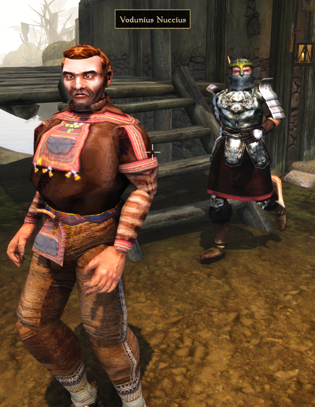

# ErnGearRandomizer

This is a Morrowind [OpenMW](https://openmw.org/) NPC gear randomizer. It randomly swaps out clothing, weapons, and armor on Morrowind NPCs.

This has *no dependencies* on any other mods and will *work with all content*, whether provided by a mod or with the base game.

Every playthrough will result in different gear for NPCs.

Even though there are safeties in place to not break Vanilla or Expansion quests, it's possible that quests might be harder or broken. Quests provided by mods are susceptible to breaking more.

This is a screenshot of the game when randomization chance is maximized:



## Installing
Extract [main](https://github.com/erinpentecost/ErnGearRandomizer/archive/refs/heads/main.zip) to your `mods/` folder.


In your `openmw.cfg` file, and add these lines in the correct spots:

```yaml
data="/wherevermymodsare/mods/ErnGearRandomizer-main"

content=ErnGearRandomizer.omwscripts
```

## Configuring

You can change the settings for the mod in-game.

* Randomization chance per item.
* Enable/Disable clothing swaps.
* Enable/Disable armor swaps.
* Enable/Disable weapon swaps.
* Enable/Disable enchanted item swaps.
* Enable/Disable similar-item swap restrictions.
